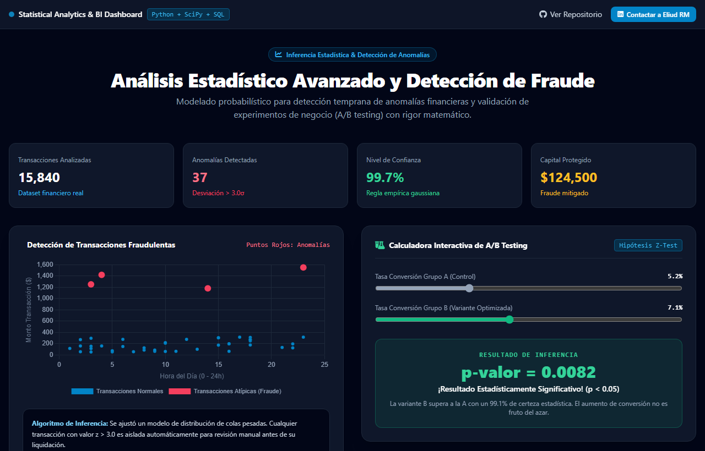
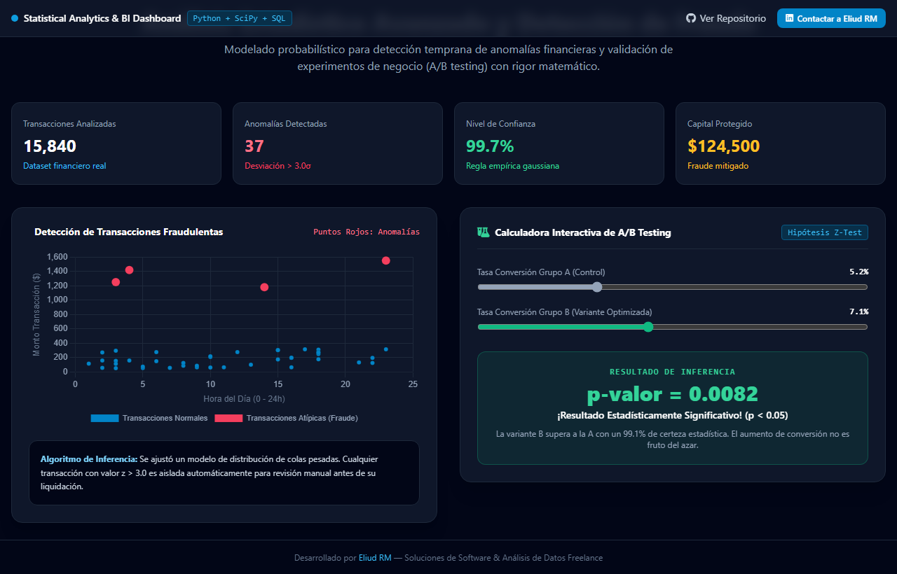

## 🇬🇧 English Summary

**Rigorous statistical analysis, A/B testing and fraud detection with Python and SQL.**

A portfolio of applied statistics work aimed at business decision-making rather than academic exercises:

- **Hypothesis testing / A-B testing** — experiment design, significance testing and readable conclusions for non-technical stakeholders
- **Fraud detection** — anomaly identification over transactional data
- **Business intelligence** — descriptive and inferential analysis turned into decisions

**Stack:** Python · Pandas · NumPy · SciPy · Matplotlib/Seaborn · SQL · Jupyter

🔗 **[Live demo](https://enybyy.github.io/statistical-data-analytics/)**

---

📖 <b>Documentación completa en español</b> (click para expandir)

# 📊 Statistical Data Analytics — Inferencia Estadística, BI y Detección de Anomalías
> **Análisis estadístico riguroso, pruebas de hipótesis (A/B Testing), detección de anomalías/fraude y consultas avanzadas SQL en bases de datos empresariales.**

  
  

  
  

---

## 📌 El Desafío de Negocio

En la era del Big Data, recopilar datos es fácil; lo difícil es **extraer conclusiones estadísticamente válidas que no lleven a errores costosos**:
- **Falsos Positivos en Decisiones de Producto y Marketing**: Implementar cambios basados en aumentos de ventas pasajeros sin validar significancia estadística conduce a desperdicio de capital.
- **Riesgo por Fraude Transaccional**: No contar con modelos probabilísticos para detectar transacciones atípicas permite que operaciones fraudulentas pasen desapercibidas.
- **Silos de Información Relacional**: Dificultad para consultar y transformar esquemas de bases de datos relacionales en métricas ejecutivas.

---

## 💡 La Solución Implementada

Este repositorio reúne un arsenal de **técnicas estadísticas avanzadas, modelos probabilísticos y análisis de bases de datos relacionales**:

1. **Inferencia Estadística & Pruebas de Hipótesis (`Estadistica/Inferencial`)**:
   - Pruebas z, pruebas t de Student y análisis de p-valor para validar experimentos (A/B testing) con rigor científico.
   - Modelos de regresión lineal y múltiple para estimar impacto de variables de negocio.
2. **Probabilidad y Detección de Anomalías / Fraude (`Estadistica/Probrabilidad`)**:
   - Modelado estocástico para alertar operaciones sospechosas fuera del intervalo de 3 desviaciones estándar ($\pm 3\sigma$).
3. **Consultas Relacionales SQL (`FreeCodeCamp`)**:
   - Integración de Python con SQLite sobre bases de datos de referencia empresarial (Sakila, Chinook, Sales).

👉 **[Prueba el Dashboard Estadístico Interactivo en Vivo aquí](https://enybyy.github.io/statistical-data-analytics/)**

---

## 📈 Impacto y Mejoras Conseguidas

| Enfoque Empírico Común | Con Análisis Estadístico Riguroso | Beneficio Empresarial Directo |
|---|---|---|
| **Decisiones por intuición** | Validación formal con pruebas de hipótesis y p-valor | **Certeza matemática antes de comprometer inversiones** |
| **Monitoreo pasivo de transacciones** | Algoritmos de detección de transacciones atípicas | **Prevención activa de fraudes y chargebacks** |
| **Reportes descriptivos planos** | Modelos de regresión inferencial | **Comprensión de causalidad real del negocio** |
| **Consultas SQL lentas y desconectadas** | Pipelines reproducibles en Python + SQL | **Extracción de métricas de ventas confiables** |

---

## 🛠️ Stack Tecnológico

- **Lenguaje**: Python 3.
- **Bases de Datos & SQL**: SQLite, SQLite3, SQL Alchemy.
- **Librerías Científicas**: SciPy, Statsmodels, NumPy.
- **Manipulación de Datos**: Pandas.
- **Visualización Analítica**: Seaborn, Matplotlib, Chart.js.

---

## 📬 ¿Necesitas validar decisiones o construir analítica sólida en tu empresa?

Ofrezco consultoría en **Business Intelligence, análisis estadístico para toma de decisiones, experimentación / A/B Testing y detección de anomalías en datos de negocio**.

- **LinkedIn**: [Eliud RM](https://www.linkedin.com/in/eliud-rojas-mendoza-414652212/)
- **GitHub**: [@Enybyy](https://github.com/Enybyy)
- *Conversemos sobre cómo respaldar la estrategia de tu negocio con datos y rigor analítico.*

